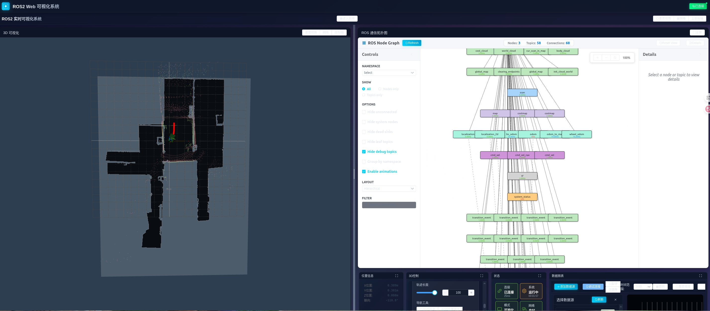

# ROS2 Web 可视化系统（RViz/RQT Web）

一个基于 Vue.js + Three.js（前端）与 FastAPI + rclpy（后端）的 ROS2 Web 可视化工具，提供常用 RViz 能力（点云、激光、路径/轨迹、地图等）与基础 RQT 工具（节点/主题拓扑可视化、主题/节点列表、系统信息）。

本 README 面向“使用者”，帮助快速运行与上手操作。开发者细节请参考仓库内的 `PROJECT_GUIDE.md` 与 `PROJECT_STATUS.md`（当前仍在优化中）。

---

## 主要特性
- 3D 场景可视化（Web 端 RViz 基础能力）
  - 点云显示（sensor_msgs/PointCloud2）
  - 2D 激光雷达（sensor_msgs/LaserScan）
  - 地图（nav_msgs/OccupancyGrid）
  - 机器人位姿与轨迹（nav_msgs/Odometry 等）
  - 标记/路径等常用消息
- 导航交互
  - 一键发布 2D 目标点（/goal_pose, geometry_msgs/PoseStamped）
  - 一键发布 2D 位置估计（/initialpose, geometry_msgs/PoseWithCovarianceStamped）
- RQT 基础工具
  - 节点/主题关系拓扑图（界面右侧，仍在优化）
  - 主题/节点/服务/参数 列表与获取
  - 系统状态面板（CPU、连接数等，图表界面进行中）
- 易用性
  - 浏览器访问，无需本地安装 RViz
  - WebSocket 自动重连
  - 可交互的 UI 与可调参数（点大小、透明度、轨迹长度等）

---

## 运行方式

### 方式一：本地开发（推荐用于本机调试）
1) 启动后端
```bash
cd backend
python3 -m venv venv
source venv/bin/activate
pip install -r requirements.txt
python -m uvicorn app.main:app --reload --host 0.0.0.0 --port 8000
```
2) 启动前端
```bash
cd frontend
npm install
npm run dev
```
3) 访问
- 前端：`http://localhost:3000`
- 后端 API：`http://localhost:8000`
- WebSocket：通过前端自动连接 `ws://localhost:8000/ws`

### 方式二：Docker（单一容器）
```bash
docker build -t ros-web-viz .
docker run -d \
  -p 8000:8000 \
  -p 3000:3000 \
  --name ros-web-viz \
  -e ROS_DOMAIN_ID=0 \
  ros-web-viz
```
> 提示：Dockerfile 与 docker-compose 示例见仓库根目录。实际端口请以工程内配置为准。

---

## 快速上手

### A. 连接 ROS2
- 确保后端所在环境可访问 ROS2 网络（与目标节点同一个 ROS_DOMAIN_ID）。
- 前端加载后，会自动尝试通过 `ws://localhost:8000/ws` 与后端建立 Rosbridge 风格的 WebSocket 连接。

### B. 选择与查看数据
- 在右侧控制面板：
  - 选择激光类型（2D/3D）与对应主题（如 `/scan` 或点云主题）
  - 选择地图、里程计主题（如 `/odom`）
  - 调整显示参数（点大小、透明度、是否显示连线等）
- 页面左侧为 3D 场景，可拖拽旋转/缩放/平移观察。

### C. 导航交互（2D 目标点 / 2D 位置估计）
- 在控制面板“导航工具”选择：
  - 2D目标点：在 3D 场景内点击并拖拽朝向后松开，即发布到 `/goal_pose`（PoseStamped）
  - 2D位置估计：在 3D 场景内点击并拖拽朝向后松开，即发布到 `/initialpose`（PoseWithCovarianceStamped）
- 后端已实现消息发布桥接，并对 `/goal_pose` 与 `/initialpose` 使用 QoS `TRANSIENT_LOCAL`（KEEP_LAST, depth=1），支持“先发后订”。
- 可用如下命令在终端验证：
```bash
ros2 topic echo /goal_pose
ros2 topic echo /initialpose
```

### D. 轨迹显示与长度
- 在“位置信息”面板勾选“显示轨迹”。
- 轨迹长度滑块范围：10–100，默认 20，可随时调整。

---

## 已知状态 / 进行中
- 项目文档
  - `PROJECT_GUIDE.md`、`PROJECT_STATUS.md` 仍在持续打磨与更新。
- ROS 通信拓扑图
  - 已可视化，但交互与布局算法还在优化中。
- 数据图表界面
  - 基础状态展示可用，图表化界面正在完善（性能曲线、主题频率等）。

---

## 常见问题（FAQ / Troubleshooting）

### 1) 发布 2D 目标点/位置估计，终端看不到消息？
- 确认 ROS_DOMAIN_ID 一致（前后端与目标 ROS2 系统处在同一 Domain）。
- 本工程对 `/goal_pose` 与 `/initialpose` 使用 `TRANSIENT_LOCAL`，支持“先发后订”。若仍无回显：
  - 检查是否监听的是正确话题名（某些栈使用自定义话题）。
  - 检查后端日志是否有类型转换错误（尤其 PoseWithCovarianceStamped 的 covariance 长度需为 36）。

### 2) 发布了 PoseStamped，但导航栈无反应？
- 若使用 Nav2，常用的是 `NavigateToPose` Action，而非仅订阅 `/goal_pose`。本工程当前提供话题发布；如需 Action 客户端，可在后续版本中启用扩展。

### 3) 激光/点云未显示或显示异常？
- 确认选择了正确主题与消息类型。
- 点云较大时前端会限制最大点数以保证性能；可适当缩放点大小或移动相机。
- 若是 rosbag2 播放，请注意 QoS 兼容性（本工程对订阅端做了适配）。

### 4) 浏览器日志很多？
- 已默认精简非关键日志，仅保留错误与关键提示。若需要更详细的调试信息，可在代码中打开注释的调试日志或后续提供的 `verbose` 开关。

---

## 目录结构（简要）
```
ros-web-viz/
├── backend/                # FastAPI + rclpy 后端
│   └── app/                # 主体服务代码（Rosbridge、API 等）
├── frontend/               # Vue 3 + Three.js 前端
│   └── src/components/RViz # 3D 场景与控制面板
├── PROJECT_GUIDE.md        # 项目指南（开发者向，WIP）
├── PROJECT_STATUS.md       # 项目状态报告（WIP）
└── README.md               # 使用者指南（本文件）
```

## 功能界面示意

> 主界面



> 放大 rqt graph插件


> 进入拖拽模式


---

## 贡献与反馈
- 欢迎提交 Issue 或 PR。
- 功能建议：拓扑图优化、数据图表面板、Nav2 Action 支持、点云 LOD/实例化渲染等。


---

## 许可
MIT License（详见仓库 LICENSE）。
